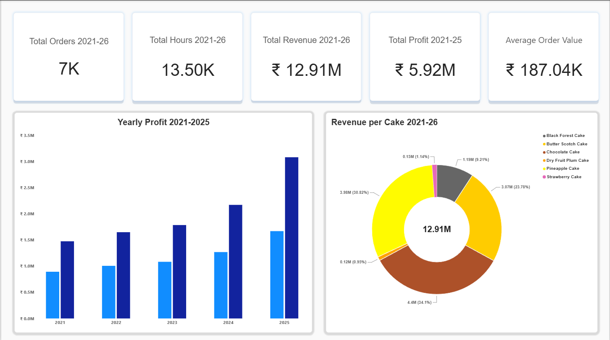
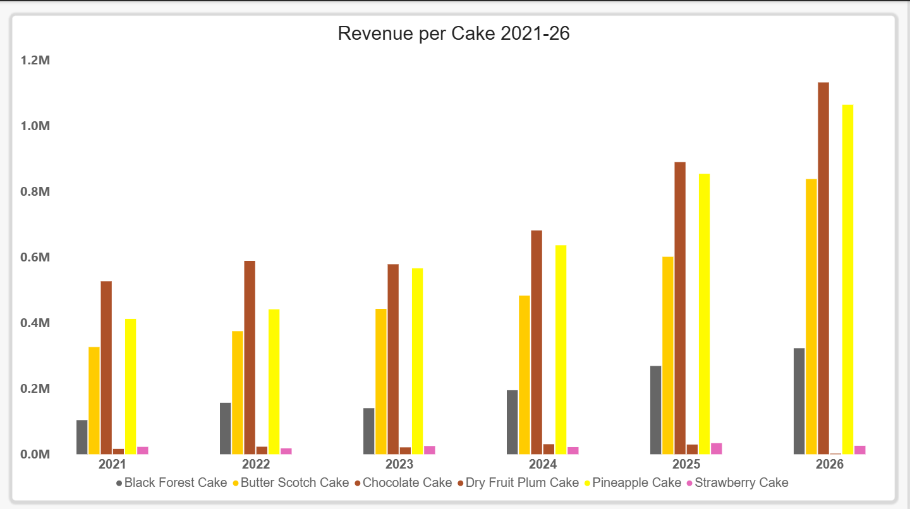
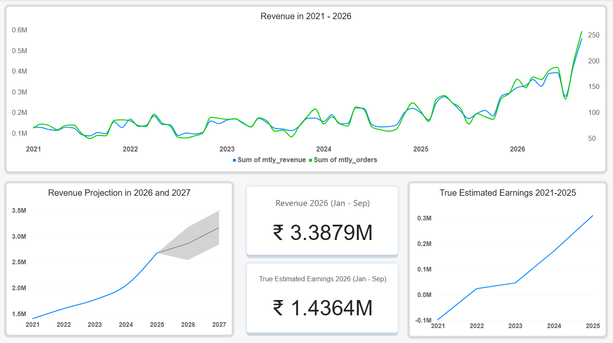

# Rohini Bakery Business Analysis

This project uses a PostgreSQL database and Power BI dashboards to track real profits, owner labor costs at ₹500/hour, and a 2-year sales forecast.

## 🏪 Business Scenario
Rohini started her solo cake baking business in 2019. She recorded all her business data from 2021 to 2026. Based on this data, she wants to find answers to three main questions:
1. **Future Trajectory:** What will be the trajectory of the business in the coming two years?
2. **Real Profitability:** Is the business really profitable after the labor opportunity cost?
3. **Business Continuation:** What evidence does the data provide about the continuation of the business in the future?

## 🧬 Data and Schema Design
Rohini notes every single cake order as a separate record, so the `orders` table represents one cake per order. 

* **Data Privacy:** To protect customer privacy, mobile numbers and names are masked into a unique anonymous `customer_id`. Each cake flavor is also assigned a unique `cake_id`.

The database is built using four tables:

### 1. Product Table (`cakes`)
Contains the master catalog information about the cake categories.

| Column Name | Data Type | Key Type | Description / Constraints |
| :--- | :--- | :--- | :--- |
| **cake_id** | INT | Primary Key | Unique catalog number for each flavor. |
| **cake_name** | VARCHAR(100) | - | Name of the premium cake flavor. |

### 2. Transaction Table (`orders`)
Records the granular details of every single cake transaction.

| Column Name | Data Type | Key Type | Description / Constraints |
| :--- | :--- | :--- | :--- |
| **order_id** | VARCHAR(50) | Primary Key | Unique tracking ID for each order transaction. |
| **customer_id** | VARCHAR(50) | - | Masked anonymous client identifier (No PII exposure). |
| **cake_id** | INT | Foreign Key | Relational link mapping back to the `cakes` table. |
| **quantity_kg** | NUMERIC(4,2) | - | Total physical weight of the cake in kilograms. |
| **sold_price** | NUMERIC(10,2) | - | Total gross revenue collected from the sale. |
| **order_date** | DATE | - | The calendar date the order was placed. |
| **delivery_type** | VARCHAR(50) | - | Logistics type (e.g., Home Delivery, Store Pickup). |

### 3. Expenses Table (`expenses`)
Tracks monthly business overhead and raw material costs.

| Column Name | Data Type | Key Type | Description / Constraints |
| :--- | :--- | :--- | :--- |
| **expense_id** | INT | Primary Key | Unique tracking ID for each monthly expense log. |
| **period_start** | DATE | - | Starting date of the monthly expense period. |
| **period_end** | DATE | - | Ending date of the monthly expense period. |
| **material_cost** | NUMERIC(10,2) | - | Total amount spent on cake ingredients. |
| **packaging_cost**| NUMERIC(10,2) | - | Total amount spent on boxes and packaging materials. |
| **delivery_cost** | NUMERIC(10,2) | - | Total cost spent on dispatching home deliveries. |
| **utility_cost**  | NUMERIC(10,2) | - | Money spent on shop electricity, water, and gas. |
| **labor_cost**    | NUMERIC(10,2) | - | Wages paid out for temporary kitchen helpers. |
| **total_monthly_expenses** | NUMERIC(10,2) | - | The absolute monthly sum of all running costs. |

### 4. Owner Work Table (`owner_work`)
Logs Rohini's personal time investment and active baking tracking.

| Column Name | Data Type | Key Type | Description / Constraints |
| :--- | :--- | :--- | :--- |
| **work_id** | INT | Primary Key | Unique log ID for tracking the owner's shift updates. |
| **period_start** | DATE | - | Starting date of the monthly tracking window. |
| **period_end** | DATE | - | Ending date of the monthly tracking window. |
| **active_baking_days** | INT | - | Total number of days spent baking during the month. |
| **total_hours_worked** | NUMERIC(6,2) | - | Total operational hours worked by Rohini. |


## 📐 Data Transformation Layer: PostgreSQL Views

To make Power BI run fast and avoid slow calculations, all the heavy data math was pushed back to the PostgreSQL database engine. I wrote three specialized views to serve as the clean data layer for the dashboard canvas.

### 1. Product Categories Monthly Performance (`cakes_mtly`)
This view joins the orders data and the cake master list. It tracks how many orders and how much revenue each cake flavor makes every month.

```sql
CREATE OR REPLACE VIEW cakes_mtly AS
SELECT
    DATE(DATE_TRUNC('month', o.order_date)) AS month,
    c.cake_name,
    COUNT(o.order_id) AS mtly_orders,
    SUM(o.sold_price) AS mtly_revenue
FROM orders o
JOIN cakes c
    ON o.cake_id = c.cake_id
GROUP BY month, c.cake_name;
```

### 2. Monthly Performance Metrics View (`mtly_metrics`)
This view aggregates daily orders into monthly summaries, joins them with shop expenses and owner work hours, and calculates pre-tax profit.

```sql
CREATE OR REPLACE VIEW mtly_metrics AS
WITH mtly_orders AS (
    SELECT
        DATE(DATE_TRUNC('month', order_date)) AS month,
        COUNT(order_id) AS mtly_orders,
        SUM(sold_price) AS mtly_revenue
    FROM orders
    GROUP BY month
)
SELECT
    mo.month,
    mo.mtly_orders,
    mo.mtly_revenue,
    mo.mtly_revenue - e.total_monthly_expenses AS mtly_profit_pre_tax,
    ow.total_hours_worked AS mtly_hours
FROM mtly_orders mo
JOIN expenses e
    ON mo.month = e.period_start
JOIN owner_work ow
    ON mo.month = ow.period_start;
```

### 3. Progressive Tax Bracket Financial Year View (`yrly_earnings`)
This view shifts the timeline into an Indian financial year context (starting April 1st) and runs a multi-tier progressive tax calculation to find real net earnings.

```sql
CREATE OR REPLACE VIEW yrly_earnings AS
WITH pre_tax AS (
    SELECT 
        EXTRACT(YEAR FROM (month - INTERVAL '3 months')) AS financial_year,
        SUM(mtly_revenue) AS financial_year_revenue,
        SUM(mtly_profit_pre_tax) AS pre_tax_earnings
    FROM mtly_metrics
    WHERE month >= '2021-04-01' AND month < '2026-04-01'
    GROUP BY financial_year
)
SELECT
    financial_year,
    ROUND(
        CASE
            WHEN pre_tax_earnings <= 300000 THEN pre_tax_earnings
            WHEN pre_tax_earnings <= 700000 THEN pre_tax_earnings - (pre_tax_earnings - 300000) * 0.05
            WHEN pre_tax_earnings <= 1000000 THEN pre_tax_earnings - (20000 + (pre_tax_earnings - 700000) * 0.10)
            WHEN pre_tax_earnings <= 1200000 THEN pre_tax_earnings - (50000 + (pre_tax_earnings - 1000000) * 0.15)
            WHEN pre_tax_earnings <= 1500000 THEN pre_tax_earnings - (80000 + (pre_tax_earnings - 1200000) * 0.20)
            ELSE pre_tax_earnings - (140000 + (pre_tax_earnings - 1500000) * 0.30)
        END
    , 2) AS earnings
FROM pre_tax;
```

## 📐 Analytics Engine: DAX Modeling & Visual Troubleshooting

### 1. The Custom Opportunity Cost Formula
To answer Rohini's question about true profitability, I created a custom DAX measure. Instead of just looking at standard bookkeeping profit, this measure subtracts the real economic value of her time, calculated at a fair labor rate of **₹500 per hour**:

```dax
True Earnings (Adjusted for Labor) = 
SUM(mtly_metrics[mtly_profit_pre_tax]) - (SUM(mtly_metrics[mtly_hours]) * 500)
```

* **Business Meaning:** By putting a ₹500/hour cost on Rohini's personal baking hours, the dashboard can show if the business is making a true structural surplus, or if she is just working long hours for low pay.

### 2. The Average Order Value (AOV) Metric
I created this measure for the Page 1 KPI banner to track the average size of customer transactions across the premium cake catalog:

```dax
Average Order Value = 
DIVIDE(SUM(mtly_metrics[mtly_revenue]), SUM(cakes_mtly[mtly_orders]), 0)
```

---

## 🛠️ Technical Challenges & Troubleshooting Case Study

### The Challenge: Filter Context Collapse (The Flat-Line Glitch)
While building the trend line for Page 3, I plotted the custom `True Earnings` measure across a timeline axis. The chart broke and showed a completely flat, straight horizontal line that repeated the exact same total number across every single month.

### Root-Cause Analysis
The project uses optimized PostgreSQL database views imported directly into Power BI without a separate, custom calendar table. 

Because the chart's X-axis field was accidentally linked to a mismatched column (`month` from the `cakes_mtly` table instead of the main `month` column from the `mtly_metrics` table), the DAX filter context collapsed. The visual engine lost track of the timeline rows and defaulted to showing the grand total for the whole database on every single point.

### Resolution Workflow
1. **Relational Realignment:** I cleaned up the visual's X-axis field well and linked it strictly to the native chronological `month` column from the active operational metrics table (`mtly_metrics`).
2. **Axis Type Reconfiguration:** Inside the visual formatting panel, I changed the X-axis type property from **Categorical** (which treats dates as unfilterable text names) to **Continuous**.
3. **Outcome:** Fixing this immediately brought back the dynamic row-by-row filtering. The flat line broke apart and snapped into a true moving trend path that accurately shows the real seasonal ups and downs of the bakery.


## ⏳ Timeline Architecture: Handling the Incomplete 2026 Dataset

A major data constraint in this project was managing the partial data for the year 2026. The database captures real monthly records up to September 2026. Because the year was not completed, calculating full-year financial run-rates using raw aggregates would create severe mathematical distortion, causing a false downward plunge on annual charts.

To keep the reporting clean and accurate, I used a dual-layer filtering strategy across the dashboard canvases:

1. **Truncating Annual Visuals to Completed Financial Years (2021 - 2025):** For high-level annual comparisons, progressive tax structures (`yrly_earnings`), and long-term business decisions, the dataset was strictly filtered to exclude 2026 data. This limits full annual calculations to the completed historical cycles (Financial Years 2021, 2022, 2023, 2024, and 2025). This ensures that any annual profit or tax assessment evaluated by Rohini represents fully settled financial years.
2. **Retaining Real-Time Monthly Volume Trends Up to September 2026:** While macro annual summaries are locked to 2025, the underlying chronological monthly charts and product tracking visuals are allowed to run up to September 2026. This ensures Rohini does not lose visibility into her recent outsized surge in order volumes and current market momentum.


### Page 1: Executive KPI & Revenue Summary

This page gives a high-level health analysis of the bakery business. I designed this page with these specific visual elements:

* **5 Milestone Performance Cards:** Five separate KPI metrics sit at the top of the canvas to highlight the core operational milestones of the business over time (Total Revenue, Total Profit, Active Months, Order Volume, and Average Order Value).
* **Revenue vs. After-Tax Earnings Comparison:** A Clustered Column Chart that displays gross revenue columns side-by-side with net yearly earnings columns. This covers 5 completed financial years and shows the direct impact of progressive tax deductions on final take-home wealth.
* **Cake Flavor Revenue Breakdown:** A Donut Chart mapping total revenue contributions across all 6 cake category classifications over the entire 6-year history (2021-2026). This shows Rohini exactly which flavors are her main money-makers.

[](images/Rohini_Bakery_Page_1.png)

### Page 2: Operational Trends & Performance Analysis

This page focuses on tracking how the product lines are growing over the timeline. I chose the chart types specifically to show honest business volume:

* **Clustered Column Chart over 100% Stacked Chart (Flavor Volume Analysis):** I deliberately used a Clustered Column Chart instead of a 100% Stacked Column Graph to track the physical kilograms of cake sold per flavor over the years. A 100% stacked chart stretches all bars to the exact same ceiling, which hides the actual growth of the business. The clustered column graph clearly shows the real volume expansion over time and stops low-volume, premium niche products (like *Strawberry Cake* and seasonal *Dry Fruit Plum Cake*) from getting squished into tiny, unreadable slivers at the top of a stacked bar.
* **Order Frequency and Quantity Trends:** Line and column combinations show the total monthly orders alongside physical order weights across the 6-year scale, tracking seasonal spikes and operational limits.

[](images/Rohini_Bakery_Page_2.png)

### Page 3: Detailed Financial & Product Insights

This page handles the deep strategic forecasting and risk analysis for the bakery. I designed the visual components to show clear financial expectations:

* **2-Year Time-Series Forecast Engine:** Using the continuous axis baseline from the completed historical years, this line chart projects expected business performance across the next two years (2026 and 2027). It shows the center run-rate so Rohini can see her most likely sales trajectory.
* **Confidence Boundary Ranges (Upper and Lower Bounds):** The forecasting visual includes shaded upper and lower boundary areas. These boundaries act as a clear risk simulator for the business owner. The upper bound shows the potential upside from a holiday order surge, while the lower bound proves that even if there is a sudden drop in sales, the business remains structurally safe and insulated.
* **Current-Year Insight Cards (Jan-Sep 2026):** Because the 2026 timeline data is incomplete and truncated from the main multi-year trend charts to prevent distortion, I deployed two standalone card visuals. These cards display the real-time **Total Revenue** and **True Estimated Earnings (After Labor Cost)** explicitly for the active January-to-September 2026 window. This gives immediate visibility into current-year performance without corrupting the historical annual trends.

[](images/Rohini_Bakery_Page_3.png)

## 🏁 Core Analytical Conclusions & Executive Decisions

By connecting the PostgreSQL database views with custom DAX opportunity cost calculations, this project answers Rohini's three main business questions:

1. **What is the trajectory of the business in the upcoming two years?** The 2-year forecast engine shows a steady, stable upward growth path. Even if we look at the lower safety boundary, the business is projected to stay safe and steady without running into a deficit.
2. **Is the business really profitable?** Yes, the bakery is highly profitable on an economic scale. After subtracting a fair salary of ₹500 per hour for Rohini's labor hours, the business still makes a solid, real surplus over the completed financial years. This proves that her premium pricing strategy successfully pays for her baking time while generating extra business profit.
3. **What evidence does the data provide about the continuation of the business?** The data strongly supports continuing and growing the business. Her annual profits are climbing steadily year-over-year. More importantly, the real monthly data for late 2026 shows a massive, unexpected surge in order volumes that goes way above past trends, proving that the market demand for her cakes is growing fast.

---

## ⚠️ Data Limitations & Future Strategic Horizons

### The Missing Variable: Social Media & Marketing Data
While this project gives clear answers using internal sales, hours, and expense records, it has one major external blind spot: a total lack of marketing data.

* **The Limitation:** Because social media metrics (like Instagram reach, ad spend, follower growth, or engagement rates) were not tracked, we cannot mathematically connect cake sales to her marketing efforts.
* **The Strategic Risk:** The explosive surge in cake orders in late 2026 cannot be linked directly to a specific viral post or a paid ad campaign. We don't know exactly what caused it from the data.
* **Future Recommendation:** For the next step of this project, the bakery should track marketing data. Connecting monthly ad spend and social media traffic timestamps with the orders data will allow us to run Customer Acquisition Cost (CAC) and Return on Ad Spend (ROAS) analytics across all premium flavors.
